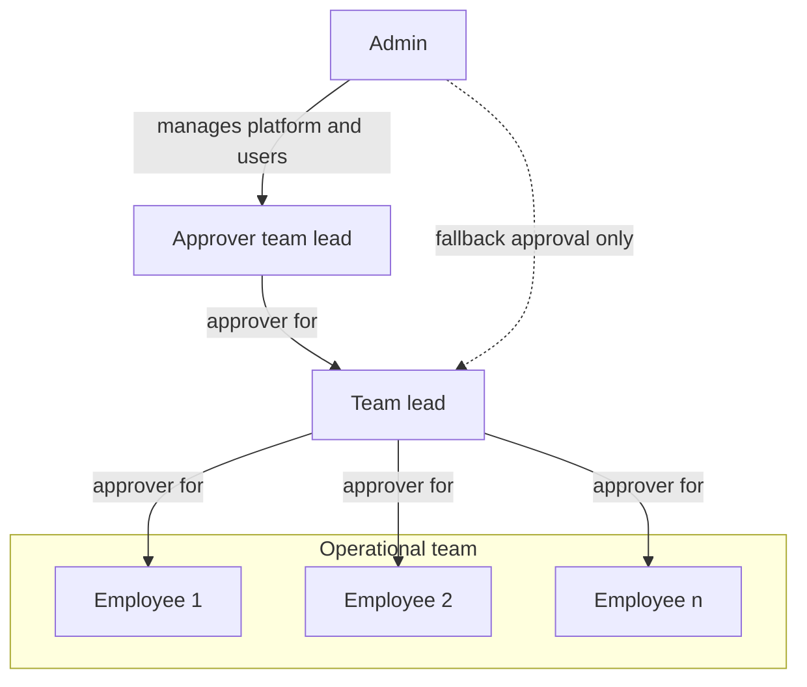
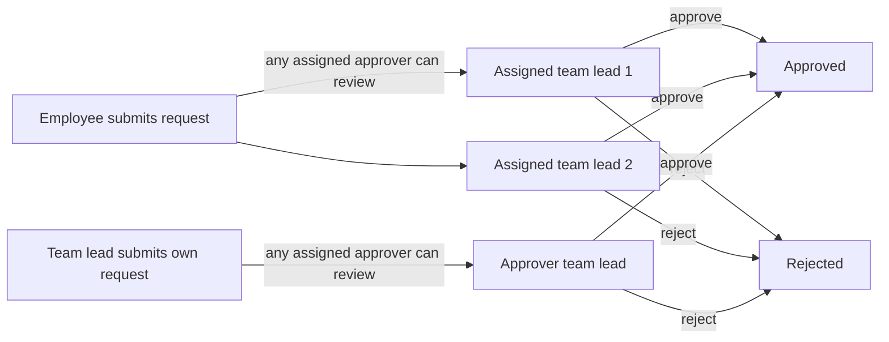

# Zerf Work Time Tracking

Simple but powerful self-hosted time tracking and absence management for teams.

Zerf covers working hours, leave and absence requests, approvals, and monthly reports in one operational tool. It supports the daily workflow between employees, team leads, and admins without expanding into a full HR or payroll suite.

`Zerf` is derived from the German word "Zeiterfassung" which means "time tracking".

## Overview

Zerf is built for day-to-day team operations.
Employees capture hours and absences, team leads review requests and submitted work, and admins manage the people and rules behind the process. The focus is on clear workflows, fast daily use on desktop or phone, and predictable self-hosted operation.

## Key features

- Time tracking with category-based entries, weekly submission, overtime visibility, and change requests.
- Absence workflows for vacation, sick leave, training, special leave, and unpaid leave.
- Approval dashboard for submitted time, absence requests, change requests, and week reopen requests.
- Team calendar with shared absence visibility and holiday context.
- Reports for monthly employee breakdowns and team-level reporting.
- CSV export for report data and downstream processing.
- Role-based administration for users, categories, holidays, settings, and audit history.
- In-app notifications with optional SMTP-based email delivery.
- Automated submission reminders: on a configured deadline day each month, users who have not yet submitted all past months' time entries receive an in-app notification and, if SMTP is enabled, an email reminder.
- Self-hosted Docker deployment with automatic backup to a local Docker volume.

## How it differs from comparable software

- It is designed for teams that want focused operational workflows rather than a generic corporate HR suite.
- It focuses on time, absences, approvals, and reporting instead of bundling payroll, recruiting, or multi-tenant enterprise features.
- It is self-hosted by default, so data stays on your own infrastructure instead of in a SaaS service.
- It is easy to operate: the provided Docker Compose entrypoints cover local, debug, and public deployments.
- It keeps the workflow opinionated and small, which reduces setup overhead for teams that want a practical operational tool instead of a broad platform.

## Roles and approval model

Every non-admin user has one or more assigned approvers. A user's approvers are the team leads or admins responsible for reviewing their time entries, absence requests, and reopen requests. Team leads can themselves report to one or more other team leads or admins. Admins are primarily technical and organizational administrators. They can approve requests as a fallback, but they are not intended to be the regular approval path.

## Time and absence management

Employees log daily working hours by category and submit completed weeks for lead review. Flextime and overtime balances are tracked automatically based on configured weekly hours.

Absences include vacation, sick leave, training, special leave, general absence, and unpaid leave. Requests follow a standard approval flow; sick leave starting today or earlier is auto-approved. Vacation budgets support annual entitlements and carryover.

After submission, employees can request changes to reviewed entries or ask to reopen a week. Leads approve or reject these requests through the same dashboard used for time and absence reviews.

### Hour calculation when sick leave overlaps with existing time entries

When an approved absence (including sick leave) covers a day on which time entries have already been recorded, the following rules apply:

- The **daily target hours are set to zero** for every day covered by an approved absence. The employee owes no hours for those days regardless of absence type.
- Any **time entries that already exist on an absence day are still counted as actual worked hours**. They remain in the record and contribute positively to the employee's flextime balance.
- As a result, an employee who logs hours on the same day as an approved sick leave entry will end up with a positive flextime delta for that day (actual > 0, target = 0).

This behavior is intentional and aligns with standard practice: an absence waives the daily obligation, but any hours the employee did log are not discarded. A typical use case is a partial sick day where the employee worked in the morning and went home ill in the afternoon — both the half-day of work and the approved sick leave coexist without conflict.

### Role organigram



A user can have multiple approvers. Any one of them can review and act on that user's requests.

### Example approval flow

Admins can still approve requests for any user when needed, even though the normal operational approval path runs through assigned team leads.



## Quick setup

The application is deliberately small in scope and operationally simple: a Rust backend, a Svelte frontend, PostgreSQL, and Docker-based deployment.

### Prerequisites

- Docker and Docker Compose on a Linux host.
- `openssl` for secret generation.
- For public deployment: a domain pointing to the host and ports 80 and 443 reachable from the internet.

### 1. Clone and prepare the environment

```bash
cp .env.example .env && chmod 600 .env
sed -i "s|ZERF_SESSION_SECRET=.*|ZERF_SESSION_SECRET=$(openssl rand -hex 32)|" .env
sed -i "s|ZERF_POSTGRES_PASSWORD=.*|ZERF_POSTGRES_PASSWORD=$(openssl rand -hex 32)|" .env
```

Edit `.env` and set the remaining required values:

- `ZERF_POSTGRES_DB` and `ZERF_POSTGRES_USER`: choose any names for the database and user.
- `ZERF_DOMAIN`: required only for public deployment (`start_public.sh`) — set this to your public hostname (e.g. `zerf.example.com`). Not needed for local deployment.
- `ZERF_PUBLIC_URL`: required for password reset emails. The provided start scripts set it automatically for local and public deployments.

### 2. Start the stack

| Mode | Command | Use case |
| --- | --- | --- |
| Local | `./start_local.sh` | Run the app locally at `http://localhost:3333` without the public reverse proxy. |
| Local debug | `./start_local_debug.sh` | Run a debug-oriented local stack for backend and frontend debugging. |
| Public | `./start_public.sh` | Run the public deployment stack with Caddy and HTTPS. |

### 3. Initial setup

On first launch, open the application in your browser. You will be prompted to create the initial administrator account with your email, name, and password.
