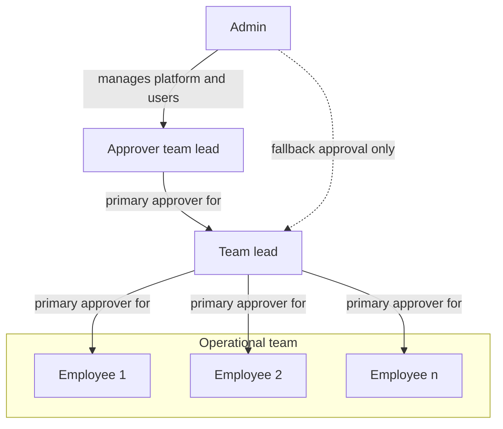
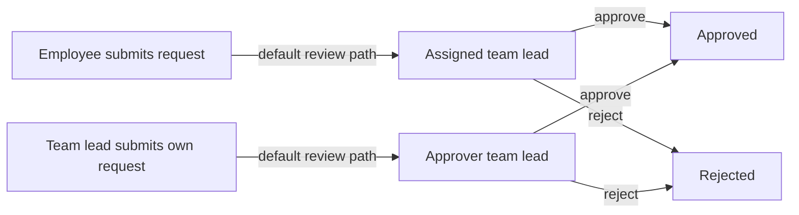

# KitaZeit

Simple but powerful self-hosted time tracking and absence management for teams.

KitaZeit helps teams record working time, request leave, manage approvals, and produce monthly reports without adopting a full HR or payroll suite. 

## Overview

KitaZeit is built for day-to-day team operations.
Employees capture hours and absences, team leads review requests and submitted work, and admins manage the people and rules behind the process. The focus is on clear workflows, fast daily use on desktop or phone, and predictable self-hosted operation.

## Key features

- Time tracking with category-based entries, weekly submission, and overtime visibility.
- Absence workflows for vacation, sick leave, training, special leave, and unpaid leave.
- Approval flows for submitted time, absence requests, change requests, and week reopen requests.
- Team calendar and monthly reporting with CSV export.
- Role-based administration for users, categories, holidays, settings, and audit history.
- In-app notifications with optional SMTP-based email delivery.
- Automatic backup to a local Docker volume

## How it differs from comparable software

- It is designed for teams that want focused operational workflows rather than a generic corporate HR suite.
- It focuses on time, absences, approvals, and reporting instead of bundling payroll, recruiting, or multi-tenant enterprise features.
- It is self-hosted by default, so data stays on your own infrastructure instead of in a SaaS service.
- It is easy to operate: the provided Docker Compose entrypoints cover local, debug, and public deployments.
- It keeps the workflow opinionated and small, which reduces setup overhead for teams that want a practical operational tool instead of a broad platform.

## Roles and approval model

The default reporting structure is many employees to one assigned team lead, and team leads can themselves report to another team lead for approval. Admins are primarily technical and organizational administrators. They can approve requests as a fallback, but they are not intended to be the regular approval path.

### Role organigram



### Example approval flow

Admins can still approve requests for any user when needed, even though the normal operational approval path runs through assigned team leads.



## Quick setup

The application is deliberately small in scope and operationally simple: a Rust backend, a Svelte frontend, PostgreSQL, and Docker-based deployment.

### Prerequisites

- Docker and Docker Compose on a Linux host.
- `openssl` for secret generation.
- For public deployment: a domain pointing to the host and ports 80 and 443 reachable from the internet.

### 1. Clone and prepare the environment

```bash
cp .env.example .env && chmod 600 .env
sed -i "s|KITAZEIT_SESSION_SECRET=.*|KITAZEIT_SESSION_SECRET=$(openssl rand -hex 32)|" .env
sed -i "s|KITAZEIT_POSTGRES_PASSWORD=.*|KITAZEIT_POSTGRES_PASSWORD=$(openssl rand -hex 32)|" .env
```

Edit `.env` and set these values:

- `KITAZEIT_ADMIN_EMAIL` is required in every deployment mode.
- `KITAZEIT_DOMAIN` is required for public deployment.

### 2. Start the stack

| Mode | Command | Use case |
| --- | --- | --- |
| Local | `./start_local.sh` | Run the app locally at `http://localhost:3000` without the public reverse proxy. |
| Local debug | `./start_local_debug.sh` | Run a debug-oriented local stack for backend and frontend debugging. |
| Public | `./start_public.sh` | Run the public deployment stack with Caddy and HTTPS. |

### 3. Sign in

Use the admin email from `.env` with the initial password `admin`.
Change that password immediately after the first login.
