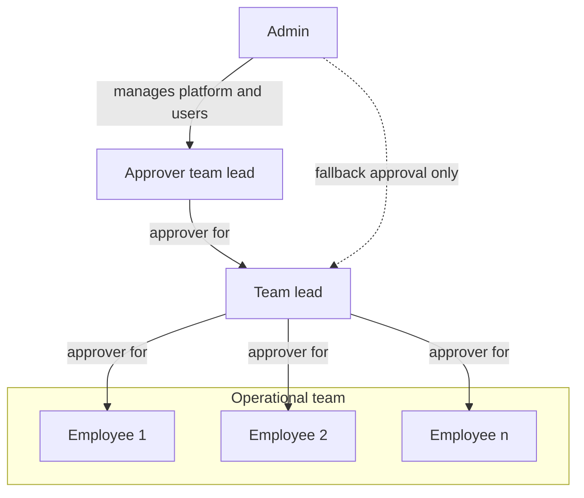
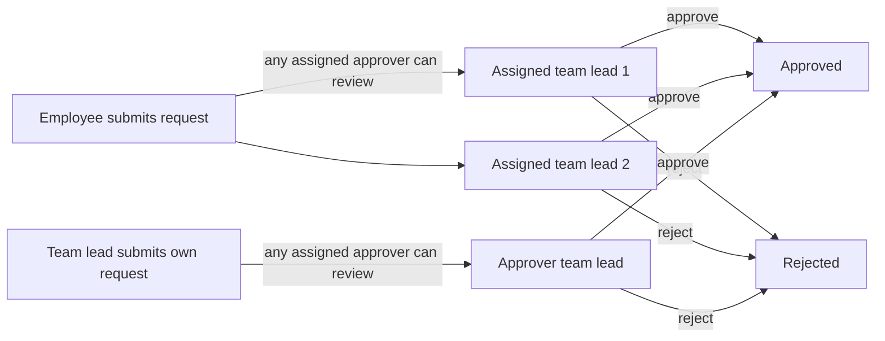

# Zerf Work Time Tracking

Simple but powerful self-hosted time tracking and absence management for teams.

Zerf covers working hours, leave and absence requests, approvals, and monthly reports in one operational tool. It supports the daily workflow between employees, team leads, and admins without expanding into a full HR or payroll suite.

`Zerf` is derived from the German word "Zeiterfassung" which means "time tracking".

## Overview

Zerf is built for day-to-day team operations.
Employees capture hours and absences, team leads review requests and submitted work, and admins manage the people and rules behind the process. The focus is on clear workflows, fast daily use on desktop or phone, and predictable self-hosted operation.

## Key features

- Time tracking with category-based entries, weekly submission, overtime visibility, and change requests.
- Absence workflows for vacation, sick leave, training, special leave, and unpaid leave.
- Approval dashboard for submitted time, absence requests, change requests, and week reopen requests.
- Team calendar with shared absence visibility and holiday context.
- Reports for monthly employee breakdowns and team-level reporting.
- CSV export for report data and downstream processing.
- Role-based administration for users, categories, holidays, settings, and audit history.
- In-app notifications with optional SMTP-based email delivery.
- Automated submission reminders: on a configured deadline day each month, users who have not yet submitted all past months' time entries receive an in-app notification and, if SMTP is enabled, an email reminder.
- Self-hosted Docker deployment with automatic backup to a local Docker volume.

## How it differs from comparable software

- It is designed for teams that want focused operational workflows rather than a generic corporate HR suite.
- It focuses on time, absences, approvals, and reporting instead of bundling payroll, recruiting, or multi-tenant enterprise features.
- It is self-hosted by default, so data stays on your own infrastructure instead of in a SaaS service.
- It is easy to operate: the provided Docker Compose entrypoints cover local, debug, and public deployments.
- It keeps the workflow opinionated and small, which reduces setup overhead for teams that want a practical operational tool instead of a broad platform.

## Roles and approval model

Every non-admin user has one or more assigned approvers. A user's approvers are the team leads or admins responsible for reviewing their time entries, absence requests, and reopen requests. Team leads can themselves report to one or more other team leads or admins. Admins are primarily technical and organizational administrators. They can approve requests as a fallback, but they are not intended to be the regular approval path.

## Time and absence management

Employees log daily working hours by category and submit completed weeks for lead review. Flextime and overtime balances are tracked automatically based on configured weekly hours.

Absences include vacation, sick leave, training, special leave, general absence, and unpaid leave. Requests follow a standard approval flow; sick leave starting today or earlier is auto-approved. Vacation budgets support annual entitlements and carryover.

After submission, employees can request changes to reviewed entries or ask to reopen a week. Leads approve or reject these requests through the same dashboard used for time and absence reviews.

## User workflow logic and dependencies

This section describes how users experience the workflow in daily operation and how the core processes depend on each other.

### 1. Weekly time entry workflow

Time entries go through the following status lifecycle:

| Status | Meaning |
| --- | --- |
| Draft | Created by the employee; visible only to that employee and approvers. Not yet handed over for review. |
| Submitted | The week has been submitted. Approvers can now review individual entries. |
| Approved | An approver has accepted the entry. Counts fully in flextime balance and reports. |
| Rejected | An approver has rejected the entry. The employee must resolve the issue. |

Steps for the employee:

1. Create daily entries as drafts during the week.
2. Use `Submit Week` to send all draft entries of that week into review. The full week is submitted at once; individual entries cannot be submitted selectively.
3. Assigned approvers review submitted entries and approve or reject them.
4. Approved entries are final for reporting unless a later change request is accepted.

A week can only be submitted once all draft entries are ready. The current week should generally be submitted by the employee before the start of the next one, but the system does not enforce a hard deadline unless submission reminders are configured.

### 2. Changes after submission

If an employee notices an issue after week submission, two options are available:

- **Request edit** (`Bearbeitung anfordern`): asks the approver to change one specific already-submitted or approved entry — for example to correct a time or category. The approver can accept or reject this request.
- **Request reopen** (`Woche zur Bearbeitung anfordern`): asks the approver to unlock the entire week so the employee can edit entries directly again. The week reverts to draft state if the approver accepts.

Both requests are visible to the approver on the dashboard. A rejected request leaves the existing submitted or approved data unchanged.

### 3. Absence workflow

Absence requests follow this lifecycle:

| Status | Meaning |
| --- | --- |
| Requested | The employee has submitted the request; an approver has not yet acted. |
| Approved | An approver accepted the request. Target hours for covered workdays drop to zero. |
| Rejected | An approver declined the request. No change to the employee's time expectations. |
| Cancellation pending | The employee requested cancellation of an approved absence. A final approver decision is required. |
| Cancelled | The approved absence was cancelled. Target hours for covered days return to normal. |

Auto-approval rules:
- Sick leave with a start date on or before today is automatically approved without approver action.
- All other absence types require explicit approval.

Overlap handling:
- An absence request must include at least one effective workday (weekday that is not a public holiday). Pure weekend or holiday-only ranges are rejected for all absence types.
- If a non-sick absence is requested for days that already have time entries, the request is rejected. Employees must remove conflicting entries first.
- If an approved absence is later granted for a day where time entries already exist, those entries remain and are still counted as actual worked hours (see section below on sick leave overlap).

### 4. Flextime balance

The flextime balance accumulates the difference between actual hours worked and daily target hours. The target for a given day is zero when:
- It is a weekend.
- A public holiday falls on that day.
- An approved absence covers that day.
- The day is before the user's configured start date.
- The day is in the future.

On any other workday, the daily target is derived from the user's configured weekly hours divided by five working days.

The flextime chart on the dashboard shows the cumulative balance over the selected time range, including the current day. A positive balance means accrued overtime; a negative balance means hours still owed.

### 5. Submission status indicator

The `Submission status` tile on the dashboard shows whether all weeks from the user's start date up to and including last complete week have been fully submitted. "Last complete week" is the most recent week whose Sunday falls before today — the current week is excluded.

- **All submitted** (green): every week with workdays since the employee's start date has at least one submitted or approved entry per required day.
- **Weeks missing** (amber): at least one fully elapsed week has days with no submitted entry.

Approval status does not affect this indicator. A week where entries have been submitted but not yet approved still counts as submitted.

### 6. Vacation balance

The vacation section of the employee report shows:

| Field | Meaning |
| --- | --- |
| Entitlement | Annual leave days configured for the employee for the selected year (including carryover if applicable). |
| Taken | Leave days already completed (approved absences with end date in the past). |
| Planned | Leave days from approved future absences that have not yet started. |
| Requested | Leave days in pending requests not yet approved. |
| Remaining | Entitlement minus taken minus planned minus requested. |

### 7. Notifications

Users receive in-app notifications — and email notifications if SMTP is configured — when:
- An absence request is approved or rejected.
- A cancellation request on an approved absence is approved or rejected.
- A change request is approved or rejected.
- A reopen request is approved or rejected.

Approvers receive notifications when:
- An employee submits a new absence request.
- An employee submits a change request.
- An employee submits a reopen request.

A monthly submission reminder is sent to employees who have not submitted all past weeks by the configured reminder deadline.

### 8. Critical relationships users should know

| Situation | Outcome | Why it matters for users |
| --- | --- | --- |
| Non-sick absence overlaps with logged time entries | Request is rejected | Time entries must be removed first to avoid conflicting records. |
| Approved absence covers a workday | Daily target hours become 0 for that day | The day no longer counts as owed working time. |
| Time entries already exist on an approved absence day | Logged hours are still counted as actual work | Partial work on absence days remains visible in flextime totals. |
| Week not submitted | Approvers cannot see or approve that week yet | Submission is the handover step from employee to approver workflow. |
| Request edit / reopen is rejected | Existing approved/submitted records stay valid | Reporting remains stable unless approvers explicitly accept a change. |
| Sick leave with start today or earlier | Automatically approved | No approver action needed; the absence takes effect immediately. |

### 9. What users see by role

- Employee: create entries and absences, submit weeks, request edits/reopenings, track own balances and statuses.
- Approver (team lead or admin fallback): review and decide on submitted weeks, absences, change requests, and reopen requests.
- Admin: manages users, categories, holidays, settings, and acts as approval fallback when needed.

### Hour calculation when sick leave overlaps with existing time entries

When an approved absence (including sick leave) covers a day on which time entries have already been recorded, the following rules apply:

- The **daily target hours are set to zero** for every day covered by an approved absence. The employee owes no hours for those days regardless of absence type.
- Any **time entries that already exist on an absence day are still counted as actual worked hours**. They remain in the record and contribute positively to the employee's flextime balance.
- As a result, an employee who logs hours on the same day as an approved sick leave entry will end up with a positive flextime delta for that day (actual > 0, target = 0).

This behavior is intentional and aligns with standard practice: an absence waives the daily obligation, but any hours the employee did log are not discarded. A typical use case is a partial sick day where the employee worked in the morning and went home ill in the afternoon — both the half-day of work and the approved sick leave coexist without conflict.

### Role organigram



A user can have multiple approvers. Any one of them can review and act on that user's requests.

### Example approval flow

Admins can still approve requests for any user when needed, even though the normal operational approval path runs through assigned team leads.



## Quick setup

The application is deliberately small in scope and operationally simple: a Rust backend, a Svelte frontend, PostgreSQL, and Docker-based deployment.

### Prerequisites

- Docker and Docker Compose on a Linux host.
- `openssl` for secret generation.
- For public deployment: a domain pointing to the host and ports 80 and 443 reachable from the internet.

### 1. Clone and prepare the environment

```bash
cp .env.example .env && chmod 600 .env
sed -i "s|ZERF_SESSION_SECRET=.*|ZERF_SESSION_SECRET=$(openssl rand -hex 32)|" .env
sed -i "s|ZERF_POSTGRES_PASSWORD=.*|ZERF_POSTGRES_PASSWORD=$(openssl rand -hex 32)|" .env
```

Edit `.env` and set the remaining required values:

- `ZERF_POSTGRES_DB` and `ZERF_POSTGRES_USER`: choose any names for the database and user.
- `ZERF_DOMAIN`: required only for public deployment (`start_public.sh`) — set this to your public hostname (e.g. `zerf.example.com`). Not needed for local deployment.
- `ZERF_PUBLIC_URL`: required for password reset emails. The provided start scripts set it automatically for local and public deployments.

### 2. Start the stack

| Mode | Command | Use case |
| --- | --- | --- |
| Local | `./start_local.sh` | Run the app locally at `http://localhost:3333` without the public reverse proxy. |
| Local debug | `./start_local_debug.sh` | Run a debug-oriented local stack for backend and frontend debugging. |
| Public | `./start_public.sh` | Run the public deployment stack with Caddy and HTTPS. |

### 3. Initial setup

On first launch, open the application in your browser. You will be prompted to create the initial administrator account with your email, name, and password.
