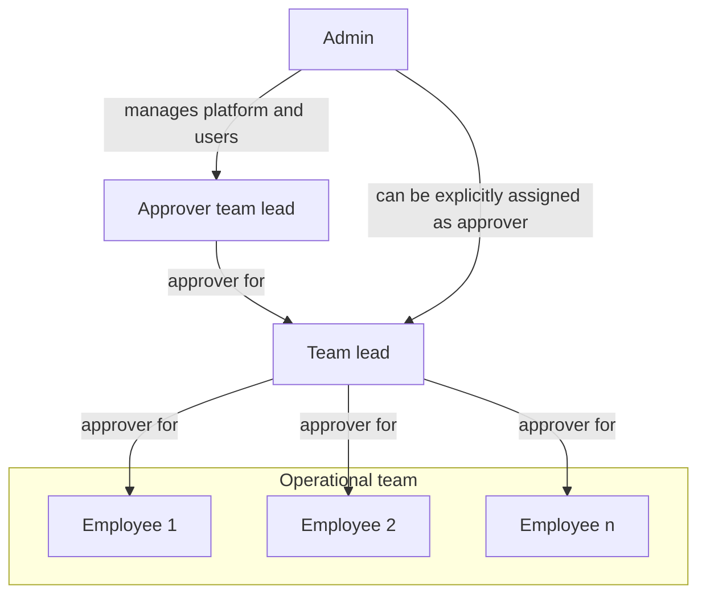
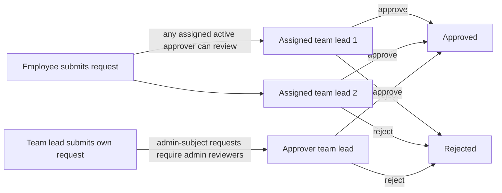

# Zerf User Guide

This guide explains how to use Zerf in daily work and how core workflow logic behaves.

Use this document if you are:

- an employee who needs a quick start,
- an approver who needs to review requests,
- an admin who needs to understand role and process behavior,
- anyone who wants clear answers about status logic, balances, and edge cases.

## Quick start

### 1. First login

1. Open your Zerf URL and sign in with your account.
2. Check your profile settings (name, language, weekly hours).
3. Confirm that an approver is assigned if you are not an admin.

### 2. Your first work week

1. Create daily time entries as `Draft`.
2. Add absences if needed (vacation, sick leave, training, etc.).
3. At end of week, use `Submit Week`.
4. Track approval results and notifications.

### 3. If you need to correct submitted data

- Use `Request edit` for one specific entry.
- Use `Request reopen` if you need to edit the whole week directly.

## Core concept: crediting vs. non-crediting entries

Zerf tracks two types of work time entries, and understanding the difference will help you use the system more effectively.

Every work category (like "Project work", "Team meeting", etc.) is configured as either **crediting** or **non-crediting**. This determines whether the hours count toward your work targets and flextime balance.

| Type | Examples | Counts toward targets? | Counts toward flextime? | Requires approval? |
| --- | --- | --- | --- | --- |
| **Crediting** | Project work, Client support, Sales | ✓ Yes | ✓ Yes | ✓ Yes |
| **Non-crediting** | Meetings, Training, Internal admin | ✗ No | ✗ No | ✓ Yes (same as all entries) |

### Key insight: workflow vs. work-math

- **Workflow** (submission, approval, reminders): All entries participate equally, whether crediting or non-crediting.
- **Work-math** (flextime, targets, reports): Only crediting entries count.

This means:

- You must submit both types of entries. Non-crediting entries do not skip the approval workflow.
- Your weekly completeness status includes both types. If you have unsubmitted non-crediting entries, your week is incomplete.
- Only crediting entry hours affect your flextime calculation and whether you hit your daily/monthly targets.
- Non-crediting entries are recorded for transparency and audit, but they do not impact your work metrics.

### Practical examples

**Example 1: Completeness check**
- You have 8h crediting work all week (submitted/approved).
- You have 2h team meetings (non-crediting, still in draft).
- Your week status: **Incomplete** — you must submit the meetings too.
- Once you submit them, your week is **Complete** and ready for reporting.

**Example 2: Flextime calculation**
- Your daily target: 8 hours
- You log: 6h crediting work + 2h training (non-crediting)
- Flextime delta: 6 − 8 = **−2 hours** (only the 6h crediting work counts)
- The 2h training is recorded but does not affect your flextime.

**Example 3: Reopen request**
- Your week has 8h crediting work and 2h meetings (both submitted).
- You request to reopen the week.
- Result: all submitted/approved entries in the week are reset to draft and can be edited again.

If you are unsure which categories in your organization are crediting, ask your admin or check the category list in the admin settings.

## Roles and approval model

Zerf uses explicit approver assignments. Approvals and notifications are not
inferred from role alone.

- Employee: records time and absences, submits weeks, requests changes.
- Approver: a user who has been explicitly assigned in `user_approvers` and is
	active.
- Admin: manages users, categories, holidays, settings, and can also be an
	approver if explicitly assigned.

Important rules:

- Every approval workflow is driven by explicit assignment.
- A user can have multiple approvers. If more than one active approver is
	assigned, all of them are treated as valid recipients and reviewers for that
	user's requests.
- Admin users do not automatically receive notifications just because they are
	admins. They only receive approval notifications when they are explicitly
	assigned.
- Non-admin approvers cannot act on admin users. Admin-subject requests are
	handled by admins only.
- Only active approvers are considered. Inactive users are ignored for routing
	and review.

This means the assignment list is the single source of truth for who gets asked
to review a request.

## Timezone and date behavior

Zerf uses one configurable application timezone for all business date logic.

What this means in practice:

- Admins can set the app timezone in admin settings (IANA zone, for example
	`Europe/Berlin`).
- "Today", current year/month boundaries, reminder scheduling dates, and
	date-based workflow checks are calculated in the configured app timezone.
- User-facing dates and timestamps in UI, emails, and notifications are
	formatted in the configured app timezone.
- End users do not need to configure a personal business timezone for workflow
	behavior; workflow date logic is consistent system-wide.

Important distinction:

- Business date logic uses app timezone.
- Security and technical timestamps (for example session and audit internals)
	remain stored and processed with standard UTC timestamp semantics in the
	database.

This prevents "wrong day" edge cases around midnight and daylight-saving
changes when users and server run in different timezones.

## Time entry workflow

### Status lifecycle

| Status | Meaning |
| --- | --- |
| Draft | Created by employee. Not yet in review. |
| Submitted | Week was submitted. Approvers can review. |
| Approved | Entry accepted. Included in reports and flextime logic. |
| Rejected | Entry rejected. Employee must resolve and resubmit when needed. |

### Weekly process

1. Create daily draft entries.
2. Submit the full week with `Submit Week`.
3. Approver accepts or rejects entries.
4. Approved entries remain valid unless a later request is approved.

### Understanding crediting vs. non-crediting entries

Each work category in Zerf is configured as either **crediting** or
**non-crediting**.

**Crediting entries** (for example project work, client support):

- count toward daily and monthly targets,
- affect flextime balances.

**Non-crediting entries** (for example meetings, training, internal admin):

- follow the same submission and approval workflow,
- do not change flextime or target-hour math.

### Important workflow rule

All entries participate in workflow equally:

- submission,
- approval/rejection,
- completeness checks,
- reminders,
- change requests,
- reopen workflows.

### Approval permissions and scope

- Non-admin approvers can review only users explicitly assigned to them.
- Non-admin approvers cannot manage admin-subject workflow items.
- Admins can review all users.

The same scope rule is applied across time entries, absences, change requests,
reopen requests, and lead-scoped team views.

## Changes after submission

If something is wrong after submission, use one of two paths:

### Option 1: Request edit (single entry)

- Use this for a focused correction on one submitted/approved entry.
- Works for both crediting and non-crediting entries.

### Option 2: Request reopen (week level)

- Use this when multiple entries in a week need correction.
- Approved reopen resets submitted/approved entries in that week to draft.
- Reopened entries become editable and can be submitted again.
- If a week has no submitted/approved entries, reopen is rejected as
	"nothing to reopen".

### Change requests and reopen interaction

When a week is reopened:

- open change requests for entries in that week are auto-applied,
- those change requests are marked as auto-applied,
- the requester edits reopened entries and submits the week again.

Reopen requests can be pending review or auto-approved, depending on the
requester's configuration.

## Absence workflow

### Status lifecycle

| Status | Meaning |
| --- | --- |
| Requested | Sent by employee, waiting for decision. |
| Approved | Accepted by approver. Covered workdays have target hours 0. |
| Rejected | Declined by approver. |
| Cancellation pending | Employee asked to cancel an approved absence. |
| Cancelled | Approved absence was cancelled. Daily target returns to normal rules. |

### Auto-approval

- Sick leave with start date on or before today is auto-approved.
- Other absence types require explicit approval.
- Auto-approved absences do not create an approval task, so approvers are not
	notified for them.

### Overlap rules

- A request must include at least one effective workday (not weekend-only, not holiday-only).
- Non-sick absence overlapping existing time entries is rejected.
- If an approved absence covers a day that already has time entries, those entries remain and still count as worked time.

Review and privacy behavior:

- Non-admin approvers can approve/reject only direct-report absences for
	non-admin users.
- Admin-subject absences are handled by admins.
- In the shared absence calendar, employees can see less-sensitive team
	visibility by default. Sensitive absence kinds are not disclosed to peers;
	leads/admins and the absence owner see full details.

Vacations and sick leave are checked against the employee's own work schedule.
A one-day request on a public holiday or on a non-working weekday does not
count as a valid absence day.

## Flextime logic

Flextime (positive or negative balance) is calculated as:

**Flextime = Actual work hours − Daily targets**

Only **crediting entries** count as actual work hours in this calculation. Non-crediting entries are recorded and approved like all others, but they do not contribute to your flextime.

### How daily targets are calculated

Daily target is the number of hours you are expected to work on a given day.

Daily target hours are `0` when:

- Day is a weekend (for your configured work schedule),
- Day is a public holiday,
- Day is covered by an approved absence (vacation, sick leave, training, etc.),
- Day is before your start date,
- Day is in the future.

Otherwise, target is calculated as:

**Daily target = (Weekly hours ÷ Workdays per week) × (1 day)**

Example: If you work 40 hours per week over 5 days, your daily target is 8 hours.

### What counts toward flextime actuals

- **Approved crediting entries:** hours count fully.
- **Submitted crediting entries:** hours do NOT count in flextime actuals.
- **Draft crediting entries:** hours do NOT count.
- **Non-crediting entries (all statuses):** hours do NOT count, regardless of approval status.

Example flextime scenario:

- Your daily target: 8 hours
- Monday approved work entries (crediting): 7 hours → Flextime delta: −1 hour
- Monday team meeting (non-crediting): 1 hour → Does NOT affect flextime
- Monday total actual hours for flextime: 7 hours (only crediting counted)
- Your Monday flextime result: 7 − 8 = −1 hour

If your team meeting were crediting instead, the result would be: (7+1) − 8 = 0 hours flextime.

## Submission status indicator

The `Submission status` tile shows whether all required past weeks have been submitted.

- **Scope:** from your start date up to and including the last complete week.
- **Current week is excluded** from this check (it is still ongoing).
- **Approval is not required** for this indicator; submission is enough.

### How completeness is determined

A week is considered **complete** (ready for flextime and monthly reports) when every required working day is accounted for by either:

- At least one submitted or approved entry (crediting or non-crediting), **or**
- An approved absence (vacation, sick leave, etc.)

A week is considered **incomplete** when:

- Any required working day has entries that are still in draft status, **or**
- Any required working day has entries that were rejected, **or**
- Any required working day has neither entries nor an absence.

### Important: non-crediting entries affect completeness

Non-crediting entries fully participate in the completeness check:

- If you have a non-crediting entry in draft on Wednesday, your entire week remains **incomplete**.
- You must submit the whole week, including the non-crediting entry, for the week to be marked complete.
- This ensures nothing slips through the approval workflow.

Even though non-crediting hours do not count toward flextime, their submission status is tracked because the submission workflow itself is comprehensive for all entries.

**Example:**

- Monday-Friday: all crediting work entries submitted/approved
- Wednesday: one team meeting (non-crediting) still in draft
- Week status: **Incomplete** (Wednesday's meeting must be submitted)
- Once you submit Wednesday's meeting, the entire week becomes **Complete**
- Flextime calculation then includes Mon-Tue, Thu-Fri crediting entries only (Wed meeting is still not counted in flextime)

States:

- `All submitted` (green): all required days in elapsed weeks are covered by submitted or approved entries.
- `Weeks missing` (amber): at least one elapsed week has missing submissions.

## Vacation balance and carryover logic

This section explains exactly how vacation balances are calculated, including carryover from the previous year.

### Balance fields in the UI

| Field | Meaning |
| --- | --- |
| Annual entitlement | Configured annual leave for the selected year (after start-date pro-rating). |
| Carryover days | Unused vacation from previous year that can be transferred into selected year. |
| Carryover remaining | Portion of transferred carryover that is still unused. |
| Carryover expiry | Date when carryover becomes unusable (MM-DD from settings, applied to selected year). |
| Already taken | Approved vacation days in the selected year that are already in the past (or up to today). |
| Approved upcoming | Approved vacation days in the selected year that are still in the future. |
| Requested | Vacation requests waiting for approval. Includes cancellation pending days. |
| Available | Total budget minus already taken, approved upcoming, and requested. |

### Core formulas

For selected year Y:

1. Annual entitlement Y:
- Uses the leave-day value configured for user and year Y.
- If user started during Y, entitlement is pro-rated.

2. Carryover days into Y:
- Start with previous year entitlement after pro-rating.
- Subtract previous year approved vacation usage.
- Never below zero.

In short:
- Carryover days Y = max(0, previous-year entitlement - previous-year approved usage)

3. Total usable budget in Y:
- If carryover has expired: only annual entitlement.
- If carryover has not expired: annual entitlement + carryover days.

4. Available days in Y:
- Available = total usable budget - already taken - approved upcoming - requested

### Which statuses affect carryover and available days

Vacation status impact:

- Approved:
	- Counts as usage for budget checks.
	- Split into already taken or approved upcoming depending on date.
- Requested:
	- Reserves budget and is counted in requested.
	- Not counted as already taken.
- Cancellation pending:
	- Still reserves budget and is counted in requested.
	- Reason: cancellation is not final until approver decision.
- Rejected or cancelled:
	- No budget impact.

Important distinction:

- Carryover source (how many days are transferred from previous year) uses previous-year approved usage only. Cancellation-pending days from the previous year do not reduce next year's carryover: while a cancellation is undecided we favor the user and assume the day may be returned. If the cancellation is later rejected, the day reverts to approved and the carryover recomputes downward on the next read.
- Current-year availability uses approved plus requested plus cancellation pending reservation.

### Carryover expiry behavior

The carryover expiry setting is configured as MM-DD in admin settings.

- Example setting 03-31 means carryover for year Y expires on Y-03-31.
- After expiry, transferred carryover is not part of total usable budget.

Carryover remaining is consumed by approved taken days:

- With expiry date:
	- Only approved days taken up to min(expiry date, today) reduce carryover remaining.
- Without valid expiry date:
	- All already taken approved days reduce carryover remaining.

Approved upcoming days do not consume carryover remaining yet, because they are not taken yet.

### Cross-year vacation requests

If one vacation request spans two years, Zerf validates both years separately:

- Part inside start year is checked against start-year budget.
- Part inside end year is checked against end-year budget.
- Carryover into end year is derived from remaining start-year entitlement.

This prevents a request from being valid in one year but over budget in the other year.

### Worked examples

Example A: standard carryover

- 2026 entitlement: 30
- 2026 approved vacation used: 22
- Carryover into 2027: 8
- 2027 entitlement: 30
- 2027 total budget before expiry: 38

Example B: pending requests reserve budget

- Total budget: 38
- Already taken: 5
- Approved upcoming: 4
- Requested (pending): 3
- Available: 38 - 5 - 4 - 3 = 26

Example C: cancellation pending

- One approved upcoming day is moved to cancellation pending.
- Approved upcoming decreases by 1.
- Requested increases by 1.
- Available stays unchanged until cancellation is approved or rejected.

### Why this can feel strict

Users sometimes see that available days do not increase immediately after requesting cancellation. This is intentional.

- A cancellation request is not final.
- The day stays reserved until approver decision.
- This avoids overbooking the same budget window during pending review.

## Notifications

### Employee receives notifications when

- time entry is approved or rejected,
- absence is approved or rejected,
- absence cancellation is approved or rejected,
- change request is approved or rejected,
- reopen request is approved or rejected,
- a monthly submission reminder is triggered on the configured deadline day (lists past weeks that are still not submitted).

### Approver receives notifications when

- a time entry is submitted (whether crediting or non-crediting),
- an absence request is submitted,
- a change request is submitted,
- a reopen request is submitted,
- a weekly approval reminder is triggered (pending items awaiting review).

### Who gets notified

- Only explicitly assigned approvers receive approval notifications and reminders.
- If a user has multiple active approvers, each of them receives the same
	request notification.
- Admin notifications and reminders are sent based on explicit assignment.
- Inactive approvers are skipped.
- For admin-subject workflows, only admins can act on the request.

This also applies to reminder emails and in-app reminders: Zerf reminds the
users who are actually assigned, not all users with a privileged role.

### Important: non-crediting entries trigger reminders too

Because non-crediting entries participate in the full approval workflow:

- **Submission reminders** go to employees who have ANY incomplete entries (crediting or non-crediting).
  - If you have unsubmitted crediting work and unsubmitted non-crediting meetings, you receive the reminder.
  - If you have only unsubmitted non-crediting entries, you still receive the reminder (to complete the workflow).

- **Approval reminders** go to approvers when there are submitted entries awaiting their decision.
  - Approvers see and must review both crediting and non-crediting entries.
  - Approval reminders are triggered by any submitted entry type.

Notification idempotency and duplicates:

- Reminder notifications use deterministic dedupe keys to avoid duplicate
	reminder spam for the same user and reminder day.
- This applies to submission reminders and approval reminders.
- If a duplicate reminder event is attempted for the same dedupe scope, it is
	ignored safely.

### Monthly submission reminder

On the configured submission deadline day each month, every active user with weekly hours > 0 (employees and team leads alike) receives one reminder (in-app, plus email if SMTP is enabled) listing the past weeks that are not fully submitted up to that day. The current week is excluded.

The reminder is sent directly to the affected user, not to their approvers. Duplicate reminders for the same user and deadline day are suppressed via a dedupe key.

**What triggers the reminder:**
- Any required workday in a past week not covered by a submitted/approved entry or an approved absence.
- Days with only draft or rejected entries count as incomplete.
- Non-crediting entries fully participate: a day covered only by an unsubmitted non-crediting entry keeps the week incomplete.

### Weekly approval reminder

Zerf can send a weekly reminder to approvers when submitted items are waiting
for review.

- Reminder day/time follows app-timezone scheduling.
- Recipients are explicit active assignees only.
- Duplicate reminders for the same day are suppressed via dedupe keys.

**What triggers the reminder:**
- Any submitted (not approved/rejected) entries from any category type.
- Non-crediting entries are included: if an approver has pending non-crediting entries, the reminder is sent.

### Reminder toggles (admin)

Admins can manage reminder behavior in settings:

- submission reminders enabled/disabled,
- approval reminders enabled/disabled.

These toggles control whether the corresponding reminder background task sends
notifications/emails.

### Notification timestamp display

Notification and email timestamps shown to users are rendered in the configured
app timezone so users see consistent local business time.

## Important edge case: sick leave with existing time entries

If approved absence overlaps a day with recorded work:

- daily target becomes `0`,
- existing time entries still count as actual worked hours.

Result: the day can produce a positive flextime delta.

This is intentional. It supports cases like partial sick days where someone worked part of the day.

## Approval structure examples

### Role organigram

### Example approval flow

### What explicit assignment means

When an approver is assigned to a user:

- that approver receives the user's approval-related notifications,
- that approver can review the user's submitted requests,
- the user appears in that approver's visible team scope,
- the assignment must point to an active user.

When no approver is assigned:

- no approver notification route exists,
- no review queue entry is created for that relationship,
- non-admin users should be configured with at least one approver.

For admins, the assignment list matters for notifications. If an admin is
not explicitly assigned, they will not receive approval reminders or request
notifications just because they are an admin.

## Reporting behavior (important)

Zerf distinguishes between workflow coverage and work-credit math.

### Month and overtime/flextime math

- Work-credit calculations use only entries that count as work and match the
	relevant status rules (for example approved for actuals).
- Non-crediting entries remain visible in workflow but do not inflate worked
	hour balances.

### Category breakdown reports

- Category breakdowns show booked non-rejected time entries in scope (not only
	crediting categories).
- This gives a complete operational view of what was booked by category.

### Team report scope

- Admins can see all active users.
- Non-admin leads see themselves plus explicitly assigned direct reports.
- Non-admin leads do not see admin subjects in lead-scoped team reporting.

## Admin checklist for a correct setup

Use this checklist after initial deployment or major configuration changes.

1. Set app timezone in admin settings.
2. Assign explicit active approvers for all non-admin users.
3. Review reminder toggles (submission and approval reminders).
4. Confirm holiday data is loaded for current/next year.
5. Validate one end-to-end flow:
	 employee submits week -> approver receives notification -> approver reviews.

If one step is missing (especially explicit approver assignment), approval
notifications and pending queues will not behave as expected.

## FAQ

### Why can my approver not see my entries?

Your week is likely still in `Draft`. Approvers only review after `Submit Week`.

### Why was my absence rejected even though dates were valid?

Common reasons:

- range contains no effective workday,
- non-sick absence overlaps existing time entries.

### Why does my flextime increase on a sick day?

Because approved absence sets target to `0`, and recorded work still counts as actual time.

### Why does submission status show missing weeks even though current week is in progress?

Current week is excluded. Missing status is based on incomplete past full weeks.