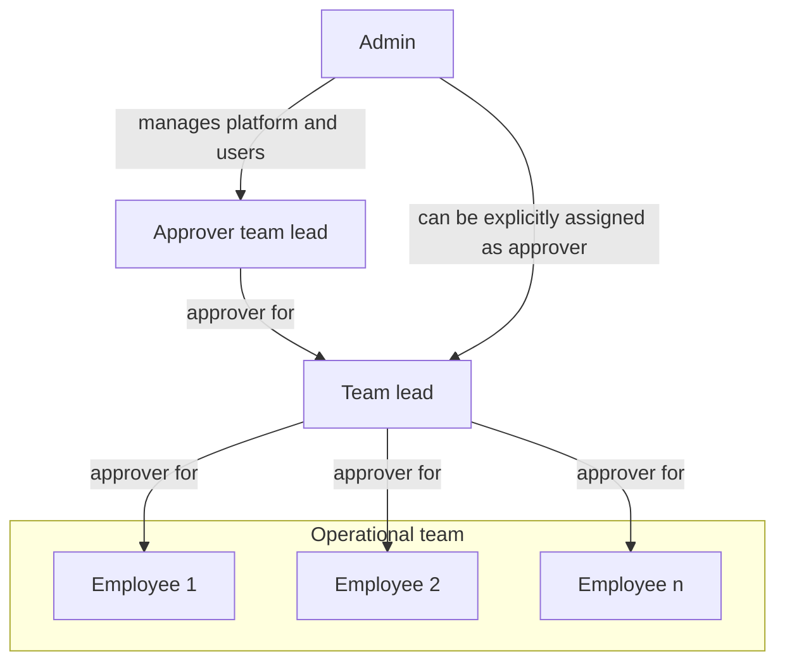
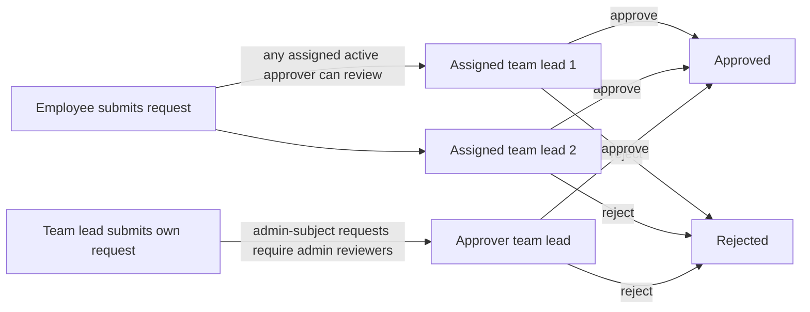

# Zerf User Guide

This guide explains how to use Zerf in daily work and how core workflow logic behaves.

Use this document if you are:

- an employee who needs a quick start,
- an approver who needs to review requests,
- an admin who needs to understand role and process behavior,
- anyone who wants clear answers about status logic, balances, and edge cases.

## Quick start

### 1. First login

1. Open your Zerf URL and sign in with your account.
2. Check your profile settings (name, language, weekly hours).
3. Confirm that an approver is assigned if you are not an admin.

### 2. Your first work week

1. Create daily time entries as `Draft`.
2. Add absences if needed (vacation, sick leave, training, etc.).
3. At end of week, use `Submit Week`.
4. Track approval results and notifications.

### 3. If you need to correct submitted data

- Use `Request edit` for one specific entry.
- Use `Request reopen` if you need to edit the whole week directly.

## Core concept: crediting vs. non-crediting entries

Zerf tracks two types of work time entries, and understanding the difference will help you use the system more effectively.

Every work category (like "Project work", "Team meeting", etc.) is configured as either **crediting** or **non-crediting**. This determines whether the hours count toward your work targets and flextime balance.

| Type | Examples | Counts toward targets? | Counts toward flextime? | Requires approval? |
| --- | --- | --- | --- | --- |
| **Crediting** | Project work, Client support, Sales | ✓ Yes | ✓ Yes | ✓ Yes |
| **Non-crediting** | Meetings, Training, Internal admin | ✗ No | ✗ No | ✓ Yes (same as all entries) |

### Key insight: workflow vs. work-math

- **Workflow** (submission, approval, reminders): All entries participate equally, whether crediting or non-crediting.
- **Work-math** (flextime, targets, reports): Only crediting entries count.

This means:

- You must submit both types of entries. Non-crediting entries do not skip the approval workflow.
- Your weekly completeness status includes both types. If you have unsubmitted non-crediting entries, your week is incomplete.
- Only crediting entry hours affect your flextime calculation and whether you hit your daily/monthly targets.
- Non-crediting entries are recorded for transparency and audit, but they do not impact your work metrics.

### Practical examples

**Example 1: Completeness check**
- You have 8h crediting work all week (submitted/approved).
- You have 2h team meetings (non-crediting, still in draft).
- Your week status: **Incomplete** — you must submit the meetings too.
- Once you submit them, your week is **Complete** and ready for reporting.

**Example 2: Flextime calculation**
- Your daily target: 8 hours
- You log: 6h crediting work + 2h training (non-crediting)
- Flextime delta: 6 − 8 = **−2 hours** (only the 6h crediting work counts)
- The 2h training is recorded but does not affect your flextime.

**Example 3: Reopen request**
- Your week has 8h crediting work and 2h meetings (both submitted).
- You request to reopen the week.
- Result: all submitted, approved, or rejected entries in the week are reset to draft and can be edited again.

If you are unsure which categories in your organization are crediting, ask your admin or check the category list in the admin settings. Inactive categories remain visible to admins for maintenance, but they are hidden from normal time-entry forms.

## Roles and approval model

Zerf uses explicit approver assignments. Approvals and notifications are not
inferred from role alone.

- Employee: records time and absences, submits weeks, requests changes.
- Assistant: records time and absences like an employee, but has no fixed
  weekly target hours and no flextime account. Assistant detection is based on
  the normalized stored role value, so case and surrounding whitespace do not
  change this behavior. This policy is role-based only. A non-assistant user
  with `0` weekly hours still follows the normal reminder and approval logic.
- Approver: a user who has been explicitly assigned in `user_approvers` and is
	active.
- Admin: manages users, categories, holidays, settings, and can also be an
	approver if explicitly assigned.

Important rules:

- Every approval workflow is driven by explicit assignment.
- A user can have multiple approvers. If more than one active approver is
	assigned, all of them are treated as valid recipients and reviewers for that
	user's requests.
- Admin users do not automatically receive notifications just because they are
	admins. They only receive approval notifications when they are explicitly
	assigned.
- Non-admin approvers cannot act on admin users. Admin-subject requests are
	handled by admins only.
- Only active approvers are considered. Inactive users are ignored for routing
	and review.

This means the assignment list is the single source of truth for who gets asked
to review a request.

## Timezone and date behavior

Zerf uses one configurable application timezone for all business date logic.

What this means in practice:

- Admins can set the app timezone in admin settings (IANA zone, for example
	`Europe/Berlin`).
- "Today", current year/month boundaries, reminder scheduling dates, and
	date-based workflow checks are calculated in the configured app timezone.
- User-facing dates and timestamps in UI, emails, and notifications are
	formatted in the configured app timezone.
- End users do not need to configure a personal business timezone for workflow
	behavior; workflow date logic is consistent system-wide.

Important distinction:

- Business date logic uses app timezone.
- Security and technical timestamps (for example session and audit internals)
	remain stored and processed with standard UTC timestamp semantics in the
	database.

This prevents "wrong day" edge cases around midnight and daylight-saving
changes when users and server run in different timezones.

## Time entry workflow

### Status lifecycle

| Status | Meaning |
| --- | --- |
| Draft | Created by employee. Not yet in review. |
| Submitted | Week was submitted. Approvers can review. |
| Approved | Entry accepted. Included in reports and flextime logic. |
| Rejected | Entry rejected. Employee must resolve and resubmit when needed. |

### Weekly process

1. Create daily draft entries.
2. Submit the full week with `Submit Week`.
3. Approver accepts or rejects the week in batch.
4. Approved entries remain valid unless a later change request or reopen is approved.

### Time-entry summary tiles

In the weekly Time Entry view, the first summary tile always shows recorded
crediting hours for the current week (rejected entries are excluded).

- Display format: `logged hours of target hours` (for example `0.0h of 23.4h target`).
- Display format: a highlighted logged-hours value plus a subtitle with only the target relation (for example `of 23.4h target`).
- Color logic:
  - red when logged hours are below the weekly target,
  - green when logged hours are equal to or above the weekly target.
- The `Status` tile remains workflow-only and uses the same value font size as
  the logged-hours tile for consistent readability.

### Understanding crediting vs. non-crediting entries

Each work category in Zerf is configured as either **crediting** or
**non-crediting**.

**Crediting entries** (for example project work, client support):

- count toward daily and monthly targets,
- affect flextime balances.

**Non-crediting entries** (for example meetings, training, internal admin):

- follow the same submission and approval workflow,
- do not change flextime or target-hour math.

### Important workflow rule

All entries participate in workflow equally:

- submission,
- approval/rejection,
- completeness checks,
- reminders,
- change requests,
- reopen workflows.

### Approval permissions and scope

- Non-admin approvers can review only users explicitly assigned to them.
- Non-admin approvers cannot manage admin-subject workflow items.
- Admins can review all users.

The same scope rule is applied across time entries, absences, change requests,
reopen requests, and lead-scoped team views.

## Changes after submission

If something is wrong after submission, use one of two paths:

### Option 1: Request edit (single entry)

- Use this for a focused correction on one submitted/approved entry.
- Works for both crediting and non-crediting entries.
- Rejected entries cannot use change requests; use reopen to make them editable again.

### Option 2: Request reopen (week level)

- Use this when multiple entries in a week need correction.
- Approved reopen resets submitted, approved, or rejected entries in that week to draft.
- Reopened entries become editable and can be submitted again.
- If a week has no submitted, approved, or rejected entries, the edit request is
	rejected with a message that the week has no submitted, approved, or rejected
	entries.

### Change requests and reopen interaction

When a week is reopened:

- open change requests for entries in that week are auto-applied,
- those change requests are marked as auto-applied,
- the requester edits reopened entries and submits the week again.

Reopen requests can be pending review or auto-approved, depending on the
requester's configuration.

## Absence workflow

### Status lifecycle

| Status | Meaning |
| --- | --- |
| Requested | Sent by employee, waiting for decision. |
| Approved | Accepted by approver. Covered workdays have target hours 0. |
| Rejected | Declined by approver. |
| Cancellation pending | Employee asked to cancel an approved absence. |
| Cancelled | Approved absence was cancelled. Daily target returns to normal rules. |

### Auto-approval

- Sick leave with start date on or before today is auto-approved.
  Your approvers receive an informational notice (not an action request).
- Other absence types require explicit approval.

### Overlap rules

- A request must include at least one effective workday (not weekend-only, not holiday-only).
- An absence request can span at most 364 days (i.e., end_date - start_date < 365).
- Non-sick absence overlapping existing time entries is rejected.
- If an approved absence covers a day that already has time entries, those entries remain and still count as worked time.

Review and privacy behavior:

- Non-admin approvers can approve/reject only direct-report absences for
	non-admin users.
- Admin-subject absences are handled by admins.
- In the shared absence calendar, employees can see less-sensitive team
	visibility by default. Sensitive absence kinds are not disclosed to peers;
	leads/admins and the absence owner see full details.

Vacations and sick leave are checked against the employee's own work schedule.
A one-day request on a public holiday or on a non-working weekday does not
count as a valid absence day.

## Flextime logic

Flextime (positive or negative balance) is calculated as:

**Flextime = Actual work hours − Daily targets**

Only **crediting entries** count as actual work hours in this calculation. Non-crediting entries are recorded and approved like all others, but they do not contribute to your flextime.

Users with role `assistant` do not have a flextime account. This behavior is
role-based (not inferred from weekly hours). For assistants, flextime and
overtime reports return no rows and submission completeness for past weeks is
treated as complete.

### How daily targets are calculated

Daily target is the number of hours you are expected to work on a given day.

Daily target hours are `0` when:

- Day is a weekend (for your configured work schedule),
- Day is a public holiday,
- Day is covered by an approved absence (vacation, sick leave, training, etc.),
- Day is before your start date,
- Day is in the future.

Flextime reduction is the exception: it follows the absence workflow and blocks normal time entry creation on that day, but it does not remove the daily target. This lets the day reduce your flextime balance intentionally.

Otherwise, target is calculated as:

**Daily target = (Weekly hours ÷ Workdays per week) × (1 day)**

Example: If you work 40 hours per week over 5 days, your daily target is 8 hours.

### What counts toward flextime actuals

- **Approved crediting entries:** hours count fully.
- **Submitted crediting entries:** hours do NOT count in flextime actuals.
- **Draft crediting entries:** hours do NOT count.
- **Non-crediting entries (all statuses):** hours do NOT count, regardless of approval status.

Example flextime scenario:

- Your daily target: 8 hours
- Monday approved work entries (crediting): 7 hours → Flextime delta: −1 hour
- Monday team meeting (non-crediting): 1 hour → Does NOT affect flextime
- Monday total actual hours for flextime: 7 hours (only crediting counted)
- Your Monday flextime result: 7 − 8 = −1 hour

If your team meeting were crediting instead, the result would be: (7+1) − 8 = 0 hours flextime.

## Submission status indicator

The `Submission status` tile shows whether all required past weeks have been submitted.

- **Scope:** from your start date up to and including the last complete week.
- **Current week is excluded** from this check (it is still ongoing).
- **Approval is not required** for this indicator; submission is enough.

### How completeness is determined

Completeness is checked at the **week level**, not the day level. It does not
matter how many days you booked or whether you reached your weekly target hours.
What counts is that you submitted the week.

A week is considered **complete** when:

- At least one entry in the week is submitted or approved (crediting or
  non-crediting), **and** no entry in the week is still in draft or rejected
  state, **or**
- The week has no entries at all and every contract workday is excused by an
  approved absence, a public holiday, or falls before your contract start date.
  (This covers e.g. full-vacation weeks.)

For users with role `assistant`, past-week completeness is always treated as
complete.

A week is considered **incomplete** when:

- Any entry anywhere in the week is still in draft or rejected state (the week
  has not been cleanly submitted), **or**
- The week has no entries and at least one contract workday is not excused.

### Important: non-crediting entries affect completeness

Non-crediting entries count toward the submission check just like crediting
entries. If you have a non-crediting entry in draft, your week remains
**incomplete** until you submit it.

**Example:**

- Monday–Friday: all crediting work entries submitted/approved
- Wednesday: one team meeting (non-crediting) still in draft
- Week status: **Incomplete** — Wednesday's draft blocks the whole week
- Once you submit Wednesday's meeting, the entire week becomes **Complete**
- Flextime calculation then includes Mon–Tue, Thu–Fri crediting entries only
  (the non-crediting meeting is not counted in flextime regardless)

States:

- `All submitted` (green): every elapsed week has been submitted (at least one entry submitted/approved, no drafts or rejections remaining).
- `Weeks missing` (amber): at least one elapsed week has missing or unfinished submissions.

## Vacation balance and carryover logic

This section explains exactly how vacation balances are calculated, including carryover from the previous year.

### Balance fields in the UI

| Field | Meaning |
| --- | --- |
| Annual entitlement | Configured annual leave for the selected year (after start-date pro-rating). |
| Carryover days | Unused vacation from previous year that can be transferred into selected year. |
| Carryover remaining | Portion of transferred carryover that is still unused. |
| Carryover expiry | Date when carryover becomes unusable (MM-DD from settings, applied to selected year). |
| Already taken | Approved vacation days in the selected year that are already in the past (or up to today). |
| Approved upcoming | Approved vacation days in the selected year that are still in the future. |
| Requested | Vacation requests waiting for approval. Includes cancellation pending days. |
| Available | Total budget minus already taken, approved upcoming, and requested. |

### Core formulas

For selected year Y:

1. Annual entitlement Y:
- Uses the leave-day value configured for user and year Y.
- If user started during Y, entitlement is pro-rated.

2. Carryover days into Y:
- Start with previous year entitlement after pro-rating.
- Subtract previous year approved vacation usage.
- Never below zero.

In short:
- Carryover days Y = max(0, previous-year entitlement - previous-year approved usage)

3. Total usable budget in Y:
- If carryover has expired: only annual entitlement.
- If carryover has not expired: annual entitlement + carryover days.

4. Available days in Y:
- Available = total usable budget - already taken - approved upcoming - requested

### Which statuses affect carryover and available days

Vacation status impact:

- Approved:
	- Counts as usage for budget checks.
	- Split into already taken or approved upcoming depending on date.
- Requested:
	- Reserves budget and is counted in requested.
	- Not counted as already taken.
- Cancellation pending:
	- Still reserves budget and is counted in requested.
	- Reason: cancellation is not final until approver decision.
- Rejected or cancelled:
	- No budget impact.

Important distinction:

- Carryover source (how many days are transferred from previous year) uses previous-year approved usage only. Cancellation-pending days from the previous year do not reduce next year's carryover: while a cancellation is undecided we favor the user and assume the day may be returned. If the cancellation is later rejected, the day reverts to approved and the carryover recomputes downward on the next read.
- Current-year availability uses approved plus requested plus cancellation pending reservation.

### Carryover expiry behavior

The carryover expiry setting is configured as MM-DD in admin settings.

- Example setting 03-31 means carryover for year Y expires on Y-03-31.
- After expiry, transferred carryover is not part of total usable budget.

Carryover remaining is consumed by approved taken days:

- With expiry date:
	- Only approved days taken up to min(expiry date, today) reduce carryover remaining.
- Without valid expiry date:
	- All already taken approved days reduce carryover remaining.

Approved upcoming days do not consume carryover remaining yet, because they are not taken yet.

### Cross-year vacation requests

If one vacation request spans two years, Zerf validates both years separately:

- Part inside start year is checked against start-year budget.
- Part inside end year is checked against end-year budget.
- Carryover into end year is derived from remaining start-year entitlement.

This prevents a request from being valid in one year but over budget in the other year.

### Worked examples

Example A: standard carryover

- 2026 entitlement: 30
- 2026 approved vacation used: 22
- Carryover into 2027: 8
- 2027 entitlement: 30
- 2027 total budget before expiry: 38

Example B: pending requests reserve budget

- Total budget: 38
- Already taken: 5
- Approved upcoming: 4
- Requested (pending): 3
- Available: 38 - 5 - 4 - 3 = 26

Example C: cancellation pending

- One approved upcoming day is moved to cancellation pending.
- Approved upcoming decreases by 1.
- Requested increases by 1.
- Available stays unchanged until cancellation is approved or rejected.

### Why this can feel strict

Users sometimes see that available days do not increase immediately after requesting cancellation. This is intentional.

- A cancellation request is not final.
- The day stays reserved until approver decision.
- This avoids overbooking the same budget window during pending review.

## Notifications

### Employee receives notifications when

- a week is approved or rejected (one notification per action, identifying the affected weeks),
- absence is approved or rejected,
- absence cancellation is approved or rejected,
- change request is approved or rejected,
- reopen request is approved or rejected,
- a monthly submission reminder is triggered on the configured deadline day (lists past weeks that are still not submitted).

If an admin approves or rejects their own item, Zerf records the audit event
and sends an in-app-only notification (no email) back to the same user.

### Approver receives notifications when

- a week is submitted (one notification identifying the submitted weeks),
- an absence request is submitted,
- a change request is submitted,
- a reopen request is submitted,
- a weekly approval reminder is triggered (pending items awaiting review).

### Who gets notified

- Only explicitly assigned approvers receive approval notifications and reminders.
- If a user has multiple active approvers, each of them receives the same
	request notification.
- Admin notifications and reminders are sent based on explicit assignment.
- Inactive approvers are skipped.
- For admin-subject workflows, only admins can act on the request.

This also applies to reminder emails and in-app reminders: Zerf reminds the
users who are actually assigned, not all users with a privileged role.

### Important: non-crediting entries trigger reminders too

Because non-crediting entries participate in the full approval workflow:

- **Submission reminders** go to employees who have ANY incomplete entries (crediting or non-crediting).
  - If you have unsubmitted crediting work and unsubmitted non-crediting meetings, you receive the reminder.
  - If you have only unsubmitted non-crediting entries, you still receive the reminder (to complete the workflow).

- **Approval reminders** go to approvers when there are submitted entries awaiting their decision.
  - Approvers see and must review both crediting and non-crediting entries.
  - Approval reminders are triggered by any submitted entry type.

Notification idempotency and duplicates:

- Reminder notifications use deterministic dedupe keys to avoid duplicate
	reminder spam for the same user and reminder day.
- This applies to submission reminders and approval reminders.
- If a duplicate reminder event is attempted for the same dedupe scope, it is
	ignored safely.

### Monthly submission reminder

On the configured submission deadline day each month, every active user with weekly hours > 0 (employees and team leads alike) receives one reminder (in-app, plus email if SMTP is enabled) listing the past weeks that are not fully submitted up to that day. The current week is excluded.

The reminder is sent directly to the affected user, not to their approvers. Duplicate reminders for the same user and deadline day are suppressed via a dedupe key.

**What triggers the reminder:**
- Any required workday in a past week not covered by a submitted/approved entry or an approved absence.
- Days with only draft or rejected entries count as incomplete.
- Non-crediting entries fully participate: a day covered only by an unsubmitted non-crediting entry keeps the week incomplete.

### Weekly approval reminder

Zerf can send a weekly reminder to approvers when submitted items are waiting
for review.

- Reminder day/time follows app-timezone scheduling.
- Recipients are explicit active assignees only.
- Duplicate reminders for the same day are suppressed via dedupe keys.

**What triggers the reminder:**
- Any submitted (not approved/rejected) entries from any category type.
- Non-crediting entries are included: if an approver has pending non-crediting entries, the reminder is sent.

### Reminder toggles (admin)

Admins can manage reminder behavior in settings:

- submission reminders enabled/disabled,
- approval reminders enabled/disabled.

These toggles control whether the corresponding reminder background task sends
notifications/emails.

### Notification timestamp display

Notification and email timestamps shown to users are rendered in the configured
app timezone so users see consistent local business time.

## Important edge case: sick leave with existing time entries

If approved absence overlaps a day with recorded work:

- daily target becomes `0`,
- existing time entries still count as actual worked hours.

Result: the day can produce a positive flextime delta.

This is intentional. It supports cases like partial sick days where someone worked part of the day.

## Approval structure examples

### Role organigram



### Example approval flow



### What explicit assignment means

When an approver is assigned to a user:

- that approver receives the user's approval-related notifications,
- that approver can review the user's submitted requests,
- the user appears in that approver's visible team scope,
- the assignment must point to an active user.

When no approver is assigned:

- no approver notification route exists,
- no review queue entry is created for that relationship,
- non-admin users should be configured with at least one approver.

For admins, the assignment list matters for notifications. If an admin is
not explicitly assigned, they will not receive approval reminders or request
notifications just because they are an admin.

## Reporting behavior (important)

Zerf distinguishes between workflow coverage and work-credit math.

### Month and overtime/flextime math

- Work-credit calculations use only entries that count as work and match the
	relevant status rules (for example approved for actuals).
- Non-crediting entries remain visible in workflow but do not inflate worked
	hour balances.
- Flextime balance charts mark absences, public holidays, and weekends with
	colored background bars so non-working days are visible in the timeline.

### Category breakdown reports

- Category breakdowns show booked non-rejected time entries in scope (not only
	crediting categories).
- This gives a complete operational view of what was booked by category.

### Team report scope

- Admins can see all active users.
- Non-admin leads see themselves plus explicitly assigned direct reports.
- Non-admin leads do not see admin subjects in lead-scoped team reporting.

## Admin checklist for a correct setup

Use this checklist after initial deployment or major configuration changes.

1. Set app timezone in admin settings.
2. Assign explicit active approvers for all non-admin users.
3. Review reminder toggles (submission and approval reminders).
4. Confirm holiday data is loaded for current/next year.
5. Validate one end-to-end flow:
	 employee submits week -> approver receives notification -> approver reviews.

If one step is missing (especially explicit approver assignment), approval
notifications and pending queues will not behave as expected.

## FAQ

### Why can my approver not see my entries?

Your week is likely still in `Draft`. Approvers only review after `Submit Week`.

### Why was my absence rejected even though dates were valid?

Common reasons:

- range contains no effective workday,
- non-sick absence overlaps existing time entries.

### Why does my flextime increase on a sick day?

Because approved absence sets target to `0`, and recorded work still counts as actual time.

### Why does submission status show missing weeks even though current week is in progress?

Current week is excluded. Missing status is based on incomplete past full weeks.

---

## Employee workflow reference

This section documents every action an employee can perform, with the exact
rules enforced by the system.

### Recording time entries

**Create a time entry**

A time entry requires a date, a start time, an end time, and a category. The
system validates:

- `entry_date` must be today or in the past (future dates are rejected).
- `entry_date` must be on or after your personal start date.
- `end_time` must be later than `start_time`.
- When `entry_date` is today, `end_time` must also not be in the future (cannot
  log an end time that has not yet occurred).
- Total crediting hours on that day must not exceed 14 hours.
- The time range must not overlap with any existing non-rejected entry on the
  same day.
- The day must not already be covered by an approved or cancellation-pending
  non-sick absence. Sick leave does not block time entry creation; all other
  absence kinds in `approved` or `cancellation_pending` status do.

A new entry is always created in `draft` status.

**Edit a time entry**

Only `draft` entries can be edited directly. Submitted or approved entries
require a change request (see below). The same validation rules as creation
apply.

**Delete a time entry**

Only `draft` entries can be deleted. Submitted, approved, or rejected entries
cannot be deleted directly; use a reopen request to make them editable first.

### Submitting a week

`Submit Week` transitions a set of draft entries to `submitted` so that
approvers can review them.

Rules:

- You can submit up to 500 entries per batch.
- All entries in the batch must belong to you.
- Only `draft` entries change status; entries already in another status are
  skipped silently.
- Once submitted, entries are locked for direct editing.

After submission, all your explicitly assigned approvers receive a notification
identifying the submitted weeks by their week labels.

### Requesting a change (single entry)

Use `Request edit` when you need to correct one submitted or approved entry
without reopening the entire week.

What you can change: date, start time, end time, category, and comment.
At least one of these must actually differ from the current values.

Validation rules:

- The entry must be owned by you.
- Entry status must be `submitted` or `approved`. Draft entries can be edited
  directly; rejected entries require a reopen instead.
- A new date cannot be in the future and cannot be before your start date.
- If new start or end time is provided, end must be after start.
- A new category must exist and must be active.
- The reason field is required and must not be empty (max 2000 characters).
- A new comment, if provided, must not exceed 2000 characters.

When created, all your assigned approvers are notified with a diff summary.

Status flow: `open` → `approved` (change applied) or `rejected` (no change
applied).

If the week is reopened while an open change request exists, the change request
is automatically applied before the week is reset to draft. The applied status
is shown in the reopen notification.

### Requesting a week reopen

Use `Request reopen` when you need to edit multiple entries in a week, or when
the specific entry you need to change is `rejected`.

Rules:

- `week_start` must be a Monday.
- The week must contain at least one entry with status `submitted`, `approved`,
  or `rejected`. An entirely draft week cannot be reopened (it is already
  editable).
- You cannot submit a second reopen request for the same week while one is
  still `pending`.

**Auto-approval:** If your `allow_reopen_without_approval` flag is enabled (set
by your team lead or admin), the reopen takes effect immediately without
requiring approval. You receive a confirmation notification; your approvers
receive an informational notice.

**Manual approval path:** The request enters `pending` status and all your
assigned approvers are notified.

When a reopen is executed (either path), the system atomically:
1. Applies all open change requests for entries in that week.
2. Resets all submitted, approved, and rejected entries in that week to
   `draft`.

You can then edit and resubmit the week.

### Absences: creating

**Allowed absence kinds:**
`vacation`, `sick`, `training`, `special_leave`, `unpaid`,
`general_absence`, `flextime_reduction`

**Validation rules that apply to all kinds:**

- `end_date` must be on or after `start_date`.
- The range must not exceed 365 calendar days (maximum end date is start + 364
  days, i.e., end_date - start_date ≤ 364).
- The range must include at least one effective workday. An effective workday
  is a day that is both a contract workday (based on your `workdays_per_week`)
  and not a public holiday. A request covering only weekends or holidays is
  rejected.
- `start_date` must be on or after your employment start date.
- Comment, if provided, must not exceed 2000 characters.

**Additional rules for vacation:**

- The vacation balance for all years covered by the request is validated at
  creation time. Insufficient balance blocks the request.

**Additional rules for sick leave:**

- `start_date` cannot be more than 30 days before today.
- If `start_date` is today or earlier: sick leave is **auto-approved** immediately.
  Your approvers receive an informational notice (not an action request).
- If `start_date` is in the future: sick leave enters `requested` status and
  requires approval like any other absence.

**Overlap and time-entry conflict:**

- Any absence overlapping another existing absence is rejected.
- A non-sick absence (vacation, training, etc.) that overlaps days with
  existing time entries is rejected. Delete or move the conflicting entries
  first.
- Sick leave overlapping existing time entries is allowed. The daily target
  becomes 0 for covered workdays, but the existing entries still count as
  worked hours.

After creation, assigned approvers receive a notification if the absence
entered `requested` status.

### Absences: editing a pending absence

Only absences in `requested` status can be edited. Approved absences cannot be
edited; cancel and re-request instead.

- The absence kind cannot be changed to or from `sick`.
- All creation validation rules apply to the updated values.

If the updated absence remains in `requested` status, approvers are notified
of the change. If it transitions to `approved` (sick leave with start_date
today or earlier), approvers receive an auto-approval notice.

### Absences: cancelling

The cancellation path depends on the current absence status:

| Current status | Action | Effect |
| --- | --- | --- |
| `requested` | Cancel | Immediate: status becomes `cancelled`. Approvers notified that request was withdrawn. No approval needed. |
| `approved` | Cancel | Deferred: status becomes `cancellation_pending`. Approvers notified to review the cancellation. Budget still reserved. |

Only `requested` and `approved` absences can be cancelled. Already cancelled,
rejected, or cancellation-pending absences cannot be cancelled again.

### Vacation balance

Your vacation balance is visible in the leave overview. The balance fields are:

- **Annual entitlement**: configured leave days for the year, pro-rated if you
  started during the year.
- **Carryover days**: unused days from the previous year (max(0, prev-year
  entitlement − prev-year approved usage)).
- **Carryover expiry**: date after which carryover is no longer usable (set by
  admin as MM-DD).
- **Already taken**: approved vacation days that are today or in the past.
- **Approved upcoming**: approved vacation days that are in the future.
- **Requested**: days in `requested` or `cancellation_pending` status.
  Budget is still reserved.
- **Available**: total usable budget − already taken − approved upcoming −
  requested.

Cross-year requests are validated per year: days in year Y consume Y's budget,
days in year Y+1 consume Y+1's budget separately.

---

## Team lead workflow reference

Team leads (role `team_lead`) and admins both have lead privileges. Unless
otherwise noted, all lead actions below apply to both roles.

### Scope of lead authority

Non-admin team leads can only act on users who are explicitly assigned to them
in `user_approvers`. This applies to:

- Viewing the team list
- Reviewing time entries, absences, change requests, and reopen requests
- Team reporting

Admin users can see and act on all users.

**Self-review restriction:** Non-admin leads cannot approve or reject their
own time entries, absences, change requests, or reopen requests. Admins may
approve or reject their own items.

**Admin-subject rule:** Non-admin leads cannot act on items submitted by admin
users. Admin-subject requests require an admin reviewer.

### Reviewing time entries (week level)

Approve or reject submitted time entries. All approval and rejection operates
at the week level. The week is the primary reviewable unit; individual entries
within a week are handled in the background.

- You must be a team lead or admin.
- Up to 500 entries per batch.
- For approve: only `submitted` entries for users within your scope are
  changed. Entries outside your scope or in a different status are silently
  skipped.
- For reject: a rejection reason is required (non-empty, max 2000 characters).
  The reason applies to all rejected entries in the batch.
- Non-admin leads cannot approve/reject their own entries (those entries are
  silently skipped). Admins may approve their own entries.
- Non-admin leads can only act on their direct reports' entries.
- Employees receive one notification per approval or rejection, identifying
  the affected weeks by their labels. Self-reviewed entries by admins receive
  in-app-only notifications (no email).

### Reviewing an absence

Approve or reject an absence in `requested` status.

- You must be a team lead or admin.
- Non-admin leads can only act on direct reports' absences.
- Non-admin leads cannot approve/reject their own absence.
- Only `requested` absences can be approved or rejected.
- Rejection requires a reason (non-empty, max 2000 characters).

**Vacation re-validation at approval time:** When approving a vacation absence,
the system re-validates the vacation balance against the employee's current
entitlement. If another vacation was approved in the meantime that exhausted the
budget, the approval is blocked.

**Time-entry conflict check at approval:** For non-sick absences, the system
re-checks that no time entries exist on the covered days at approval time. If
entries were created after the request was submitted, the approval is blocked.

**Concurrency protection:** If two approvers attempt to approve/reject the same
absence at the same time, the second request receives a conflict error and must
retry.

### Reviewing an absence cancellation

Approve or reject a `cancellation_pending` absence.

- You must be a team lead or admin.
- Non-admin leads can only act on direct reports' absences.
- Non-admin leads cannot act on their own absence.
- Only `cancellation_pending` absences can have their cancellation reviewed.

| Decision | Result | Employee notification |
| --- | --- | --- |
| Approve cancellation | Absence status → `cancelled`. Budget released. | Yes (unless self-action by admin) |
| Reject cancellation | Absence status → `approved` (restored). Budget still consumed. | Yes (unless self-action by admin) |

### Reviewing a change request

Approve or reject an open change request for an employee's time entry.

- You must be a team lead or admin.
- Non-admin leads can only act if they are explicitly assigned as approver for
  the requesting user.
- Non-admin leads cannot approve/reject their own change request.
- Only `open` change requests can be reviewed.

On approval: the proposed changes are applied to the time entry. The entry's
date, time, category, and/or comment are updated according to the change
request. The entry keeps its current status (submitted or approved).

On rejection: the time entry is unchanged.

**Concurrency protection:** The system acquires an advisory lock on the user and
uses a `FOR UPDATE` row lock on the change request. A concurrent duplicate
approval receives a conflict error.

### Reviewing a reopen request

Approve or reject a `pending` reopen request.

- You must be a team lead or admin.
- Non-admin leads can only act if explicitly assigned as approver for the
  requesting user.
- Non-admin leads cannot approve/reject their own reopen request.
- Only `pending` reopen requests can be reviewed.
- A rejection reason is required for rejection (non-empty, max 2000
  characters).

On approval: the reopen is executed atomically — open change requests are
applied and all submitted/approved/rejected entries in the week are reset to
`draft`. The employee receives a notification; if change requests were applied,
the notification includes a change summary.

On rejection: the week remains unchanged. The employee receives a rejection
notification with the reason.

### Team settings: reopen policy

Team leads can set the `allow_reopen_without_approval` flag for their direct
reports. Admins can set it for any user (including themselves).

Non-admin team leads cannot modify their own reopen policy — only their own
approver (a higher lead or admin) may grant them auto-approval. This prevents
a lead from bypassing their own approval chain.

- When enabled: that user's future reopen requests are auto-approved
  immediately.
- When disabled: reopen requests require manual approval.
- The setting change is audit-logged (with before and after values).

### Viewing team reports

Team leads can access team-scoped reports covering their direct reports plus
themselves.

- Report date ranges are validated: from must be ≤ to, and the range must be
  less than 366 calendar days.
- Non-admin leads see only users explicitly assigned to them (plus themselves).
  Admin users are not visible in non-admin lead team reports.
- Admins see all active users.

---

## Admin workflow reference

Admins have all team lead privileges plus exclusive access to user management,
system settings, and sensitive operations.

### Creating a user

Creating a user requires admin role.

Required fields and validation:

| Field | Rule |
| --- | --- |
| `role` | Must be `employee`, `assistant`, `team_lead`, or `admin`. |
| `email` | Must be non-empty, at most 254 characters, must contain `@`. Must be unique across all users. |
| First name + last name | The combination of first and last name must be unique. |
| `weekly_hours` | 0.0 to 168.0 (hours per week). |
| `workdays_per_week` | 1 to 7 (integer). |
| `leave_days_current_year` | 0 to 366 (integer). |
| `leave_days_next_year` | 0 to 366 (integer). |
| `start_date` | The user's employment start date (used for absence validation and submission completeness). |

Additional role-specific rules:

- `assistant` users must have `weekly_hours = 0`.
- `assistant` users must have `overtime_start_balance_min = 0`.
- `assistant` users usually have annual leave set to `0` for current and next year.

Optional: `overtime_start_balance_min` (signed integer, ±525 600 minutes,
default 0). An initial flextime carry-in from before the user was created in
the system.

Optional: `approver_ids` — list of active team lead or admin user IDs to
assign as approvers.

Optional: `password` — if not provided, a 16-character random password is
generated using a cryptographically secure generator (rejection-sampling,
no modulo bias).

All new users are created with `must_change_password = true`. The user will be
forced to set a new password on first login.

A registration email is sent to the new user's address with the temporary
password (if SMTP is configured).

After creation, assign at least one active approver for non-admin users so that
approval routing works.

### Updating a user

All fields are optional in an update request. Only provided fields are changed.

Validation rules follow the same bounds as creation for each provided field.

**Anti-lockout guards:**

- An admin cannot set their own role to a non-admin value.
- An admin cannot deactivate their own account via the update endpoint.
- Removing admin rights from a user requires at least 2 active admins
  remaining after the change.
- A user with active direct reports in `user_approvers` cannot have their role
  changed to a non-approver role. Reassign their direct reports first (the
  error message states the count).
- A user who is the sole approver for admin users cannot be downgraded from
  admin to a role that cannot approve admin subjects.

When a user's role is changed or they are deactivated, all their existing
sessions are invalidated immediately.

### Deactivating a user

Deactivation prevents the user from logging in without deleting their data.

Guards:

- Cannot deactivate yourself.
- Cannot deactivate the last active admin.
- Cannot deactivate a user who is still listed as an approver for active users.
  The error message includes the count of affected users. Reassign those users
  to a different approver first.

On success: the user's `active` flag is set to false and all their sessions
are deleted.

### Deleting a user

Permanent deletion removes all user data (entries, absences, requests, leave
records).

Guards are identical to deactivation:

- Cannot delete yourself.
- Cannot delete the last active admin.
- Cannot delete a user who is still listed as an approver for active users.

There is no undo. Use deactivation if you want to preserve history.

### Resetting a password

Resets the password for any active user.

- Only active users can have their password reset (inactive users return an
  error).
- A new 16-character CSPRNG password is generated.
- `must_change_password` is set to `true` so the user is forced to change it
  after login.
- All existing sessions for that user are invalidated immediately.

The new temporary password is returned in the response (show it to the user
directly or communicate it securely — it is not re-derivable).

### Managing approver assignments

Each user's `approver_ids` list controls who receives notifications and can
review that user's requests.

Rules for valid approver entries:

- The approver must be an active user.
- The approver must have role `team_lead` or `admin`.
- Non-admin approvers cannot review admin users (even if assigned). Only
  admins can act on admin-subject requests.

When an approver is removed (by updating `approver_ids`), approval routing for
that user's future requests changes immediately. In-flight pending requests
are not automatically re-routed; previously notified approvers retain their
ability to act on existing open requests.

If a user has no assigned approvers, the system raises an error when they try
to submit a request that requires routing (non-admins require at least one
approver for time entry submission, absence requests, change requests, and
reopen requests).

### Direct correction of submitted or approved entries

Admins can directly edit a submitted or approved time entry that belongs to
another user, without requiring a change request. This is the admin correction
path.

Rules:

- The admin must be a different user from the entry owner (not editing their own entry).
- Entry status must be `submitted` or `approved`.
- The same field validation as direct creation applies (date in the past, end >
  start, no overlap, 14h crediting limit, etc.).

Admins editing their own submitted or approved entries still need to use a
change request (the admin correction path only applies to other users' entries).

### Managing annual leave

Annual leave entitlements can be set per user per year.

- Set via `leave_days_current_year` and `leave_days_next_year` when creating
  or updating a user, or via the dedicated leave-days endpoints.
- Valid range: 0 to 366 days per year.
- Changes take effect immediately for balance calculations. If you reduce a
  user's entitlement after they have already used vacation, their available
  balance may go negative.

### Revoking an approved absence

Admins can forcibly cancel an approved absence (for example, to fix a mistaken
approval).

- Only `approved` absences can be revoked.
- Revocation transitions the absence to `cancelled` and updates `reviewed_by`.
- The absence owner receives a cancellation notification (unless the admin is
  revoking their own absence).
- Budget freed by the revocation is reflected immediately in the balance
  calculation.

Revoke is distinct from cancellation: employees request cancellation;
admins revoke.

### System settings

Admins configure system-wide behavior in the settings panel:

| Setting | Description |
| --- | --- |
| App timezone | IANA zone name (e.g. `Europe/Berlin`). All date logic uses this timezone. |
| Carryover expiry (MM-DD) | Vacation carryover from the previous year expires on this date each year. Empty = no expiry. |
| Submission deadline day | Day of the month (1–28) when the monthly submission reminder is sent. |
| Submission reminders enabled | Enable/disable the monthly submission reminder background task. |
| Approval reminders enabled | Enable/disable the weekly approval reminder background task. |
| SMTP configuration | Server, port, credentials for outgoing email. Required for registration emails and email reminders. |
| Public URL | Used to construct login links in registration emails. |

### Managing categories

Categories define what employees can book time against.

- Each category has a name and a `counts_as_work` (crediting) flag.
- Inactive categories are hidden from time entry forms but remain visible to
  admins for maintenance.
- A category must be active to be used in a new time entry or change request.
- Deleting a category with existing time entries is not possible; deactivate
  instead.

### Managing holidays

Holidays define public holidays that are excluded from:

- Absence effective-workday checks (a date range spanning only holidays
  contains no effective workday).
- Submission-completeness checks (holidays are not required workdays).
- Submission-reminder unsubmitted-week detection.

Holidays are date-scoped. Load holiday data for the current and next year to
ensure all checks work correctly into the near future.

### Backup and restore metadata

Docker start scripts pass the current Git commit into the built images as
`ZERF_GIT_COMMIT`. Scheduled backups write the same value into a
`zerf-<timestamp>.metadata` sidecar next to the PostgreSQL dump. The database
also stores its created Git commit, created migration version, current runtime
commit, and current SQLx migration version in `system_metadata`.

Use this metadata during restore planning to select the matching application
revision before starting Zerf against the restored database. Databases created
before this metadata existed may show `unknown` for the created values; use the
runtime values for those backups.

---

## Status transition reference

### Time entry statuses

```
draft ──[submit]──> submitted ──[approve]──> approved
                          └──[reject]───> rejected

rejected ──[reopen approved]──> draft
submitted ──[reopen approved]──> draft
approved ──[reopen approved]──> draft
```

### Absence statuses

```
(creation)
  sick (start ≤ today) ──> approved (auto)
  other / future sick  ──> requested

requested ──[approve]──────────────> approved
requested ──[reject]───────────────> rejected
requested ──[cancel by employee]───> cancelled

approved  ──[cancel by employee]───> cancellation_pending
                                          ├─[approve cancellation]──> cancelled
                                          └─[reject cancellation]───> approved
approved  ──[revoke by admin]───────> cancelled
```

### Change request statuses

```
open ──[approve]──> approved (change applied to entry)
     └──[reject]──> rejected (entry unchanged)
     └──[week reopened]──> approved (auto-applied)
```

### Reopen request statuses

```
(creation)
  allow_reopen_without_approval=true  ──> auto_approved (week immediately reopened)
  otherwise                           ──> pending

pending ──[approve]──> approved (week reopened)
        └──[reject]──> rejected
```
