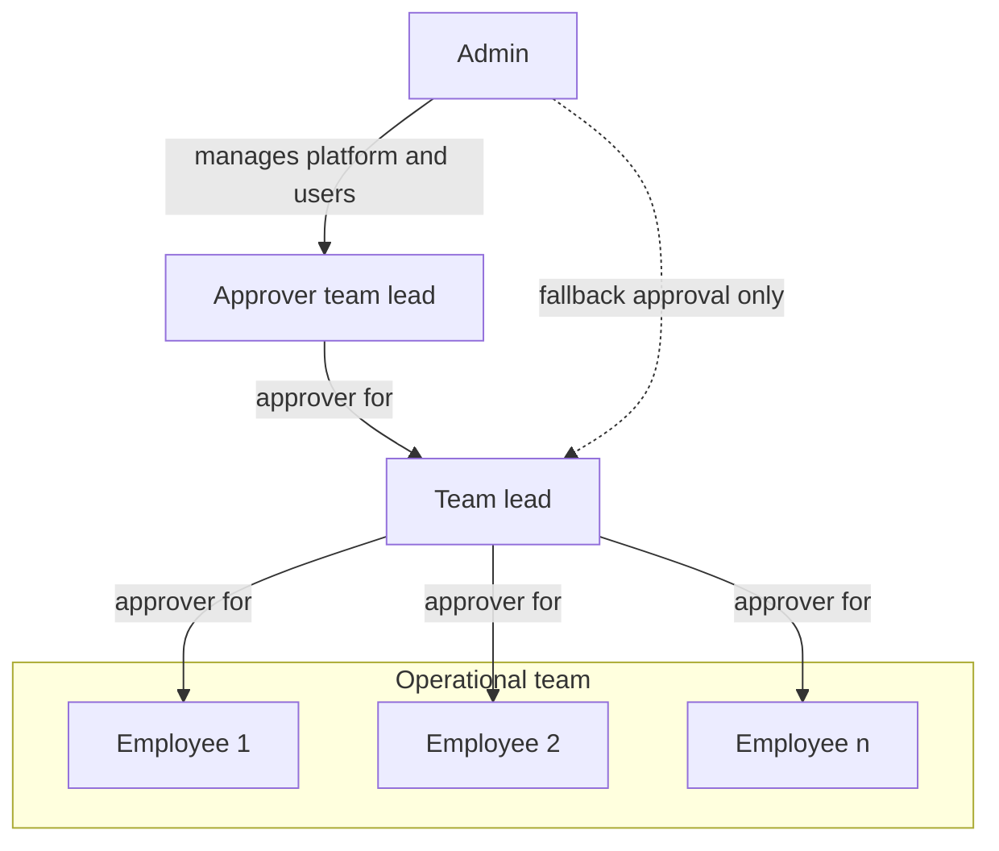
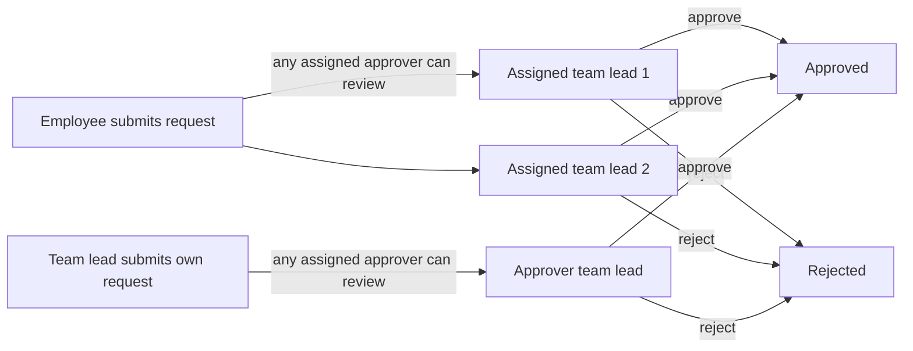

# Zerf User Guide

This guide explains how to use Zerf in daily work and how core workflow logic behaves.

Use this document if you are:

- a new employee who needs a quick start,
- an approver who needs to review requests,
- an admin who needs to understand role and process behavior,
- anyone who wants clear answers about status logic, balances, and edge cases.

## Quick start for new users

### 1. First login

1. Open your Zerf URL and sign in with your account.
2. Check your profile settings (name, language, weekly hours).
3. Confirm that an approver is assigned if you are not an admin.

### 2. Your first work week

1. Create daily time entries as `Draft`.
2. Add absences if needed (vacation, sick leave, training, etc.).
3. At end of week, use `Submit Week`.
4. Track approval results and notifications.

### 3. If you need to correct submitted data

- Use `Request edit` for one specific entry.
- Use `Request reopen` if you need to edit the whole week directly.

## Roles and approval model

Every non-admin user has one or more assigned approvers.

- Employee: records time and absences, submits weeks, requests changes.
- Approver (team lead or admin fallback): reviews submitted weeks and requests.
- Admin: manages users, categories, holidays, settings, and can approve as fallback.

A user can have multiple approvers. Any one of them can review and act on that user's requests.

## Time entry workflow

### Status lifecycle

| Status | Meaning |
| --- | --- |
| Draft | Created by employee. Not yet in review. |
| Submitted | Week was submitted. Approvers can review. |
| Approved | Entry accepted. Included in reports and flextime logic. |
| Rejected | Entry rejected. Employee must resolve and resubmit when needed. |

### Weekly process

1. Create daily draft entries.
2. Submit the full week with `Submit Week`.
3. Approver accepts or rejects entries.
4. Approved entries remain valid unless a later request is approved.

Important behavior:

- Submission is done for the full week, not per single entry.
- A not-yet-submitted week is not reviewable by approvers.

## Changes after submission

If something is wrong after submission:

- `Request edit` (`Bearbeitung anfordern`): approver updates one already submitted/approved entry.
- `Request reopen` (`Woche zur Bearbeitung anfordern`): approver unlocks the week; affected entries move back to editable draft flow.

If rejected, existing submitted/approved data stays unchanged.

## Absence workflow

### Status lifecycle

| Status | Meaning |
| --- | --- |
| Requested | Sent by employee, waiting for decision. |
| Approved | Accepted by approver. Covered workdays have target hours 0. |
| Rejected | Declined by approver. |
| Cancellation pending | Employee asked to cancel an approved absence. |
| Cancelled | Approved absence was cancelled. Daily target returns to normal rules. |

### Auto-approval

- Sick leave with start date on or before today is auto-approved.
- Other absence types require explicit approval.

### Overlap rules

- A request must include at least one effective workday (not weekend-only, not holiday-only).
- Non-sick absence overlapping existing time entries is rejected.
- If an approved absence covers a day that already has time entries, those entries remain and still count as worked time.

## Flextime logic

Flextime is based on:

- actual worked hours,
- minus daily target hours.

Daily target hours are `0` when:

- day is weekend,
- day is a public holiday,
- day is covered by approved absence,
- day is before user start date,
- day is in the future.

Otherwise, target is derived from weekly hours divided by five.

## Submission status indicator

The `Submission status` tile checks if all required past weeks are submitted.

- Scope: from user start date up to and including the last complete week.
- Current week is excluded.
- Approval is not required for this indicator; submission is enough.

States:

- `All submitted` (green): all required days in elapsed weeks are covered by submitted or approved entries.
- `Weeks missing` (amber): at least one elapsed week has missing submissions.

## Vacation balance logic

| Field | Meaning |
| --- | --- |
| Entitlement | Annual leave configured for the selected year (incl. carryover). |
| Taken | Approved leave days already in the past. |
| Planned | Approved future leave days. |
| Requested | Pending leave requests. |
| Remaining | Entitlement minus taken minus planned minus requested. |

## Notifications

### Employee receives notifications when

- absence is approved or rejected,
- absence cancellation is approved or rejected,
- change request is approved or rejected,
- reopen request is approved or rejected.

### Approver receives notifications when

- a new absence request is submitted,
- a change request is submitted,
- a reopen request is submitted.

### Monthly reminder

Users with incomplete past submissions receive a monthly reminder on the configured reminder deadline day (in-app, plus email if SMTP is enabled).

## Important edge case: sick leave with existing time entries

If approved absence overlaps a day with recorded work:

- daily target becomes `0`,
- existing time entries still count as actual worked hours.

Result: the day can produce a positive flextime delta.

This is intentional. It supports cases like partial sick days where someone worked part of the day.

## Approval structure examples

### Role organigram

### Example approval flow

## FAQ

### Why can my approver not see my entries?

Your week is likely still in `Draft`. Approvers only review after `Submit Week`.

### Why was my absence rejected even though dates were valid?

Common reasons:

- range contains no effective workday,
- non-sick absence overlaps existing time entries.

### Why does my flextime increase on a sick day?

Because approved absence sets target to `0`, and recorded work still counts as actual time.

### Why does submission status show missing weeks even though current week is in progress?

Current week is excluded. Missing status is based on incomplete past full weeks.